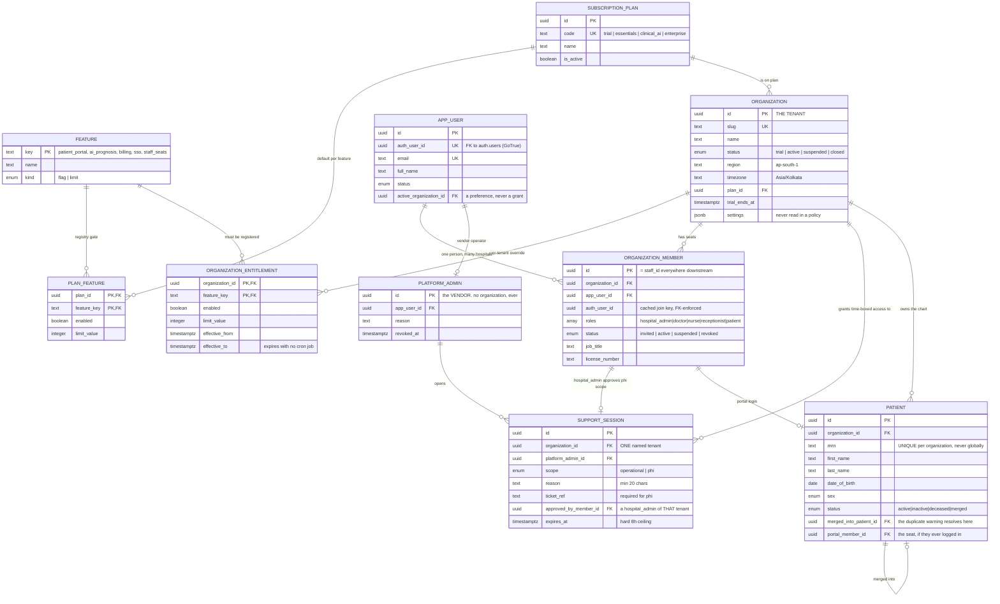
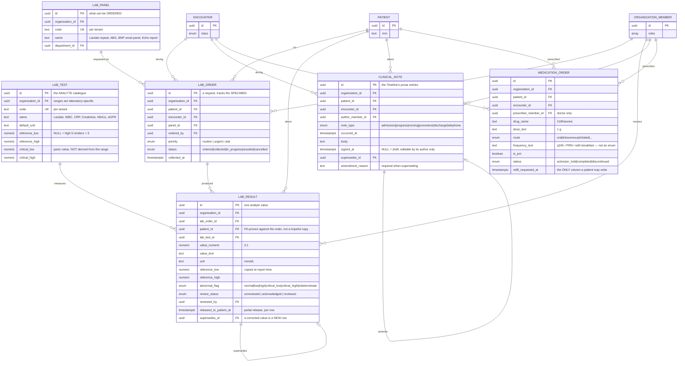
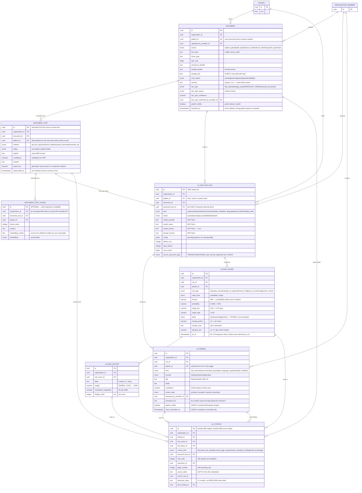
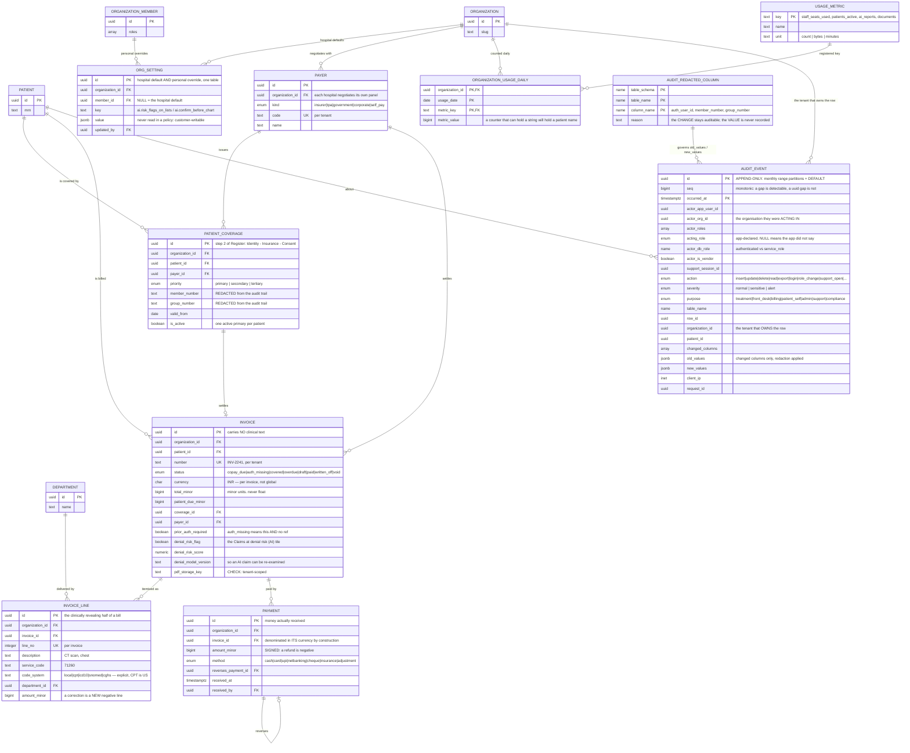

# Prognosify entity model

43 tables in five layers. Every relationship drawn below that crosses into tenant data is a
**composite** foreign key on `(parent_id, organization_id)`, not on `parent_id` alone — which is
what turns a cross-tenant reference into a foreign-key violation instead of a code-review finding.

Columns shown are the ones that carry meaning for the model: keys, the tenant discriminator, and
the fields the 20 screens actually read. Enums, CHECK constraints, timestamps and audit columns are
in the migrations.

---

## 1. Tenancy, identity and access

The layer everything else hangs off. `organization` is the tenant; `app_user` is a person;
`organization_member` is that person's seat in one hospital and is `staff_id` everywhere downstream.
`platform_admin` is the vendor side and holds no organisation, ever — which is what contains
`super_admin` by default.

**Why entitlements are three tables and not a `jsonb` blob.** A blob has no key registry, so
`ai_prognosis` and `ai-prognosis` are both "valid" and one silently fails — open is a billing leak,
closed is a support ticket at 2am. The Super Admin screen also has to *render* a list of features to
toggle: with a catalogue that is a `SELECT`, with a blob it is a hard-coded frontend array that
drifts. And a per-tenant override needs a validity window, a grantor and a note. Those are columns.

---

## 2. Hospital configuration and the clinical core

`department` is owned by 020 and extended by 040 — one table, one definition. Care-team membership is
both the "Care team" card on the patient screen **and** the access-control spine behind
`app.care_patient_ids()`; those being the same table is the point.

```mermaid
erDiagram
    ORGANIZATION {
        uuid id PK
        text slug
    }
    ORGANIZATION_MEMBER {
        uuid id PK "staff_id"
        uuid organization_id FK
        array roles
    }
    PATIENT {
        uuid id PK
        uuid organization_id FK
        text mrn
    }
    DEPARTMENT {
        uuid id PK
        uuid organization_id FK
        text code UK "per tenant"
        text name "Cardiology, Radiology, Gen. medicine, Pediatrics"
        integer daily_slot_capacity "denominator of Clinic load today"
        boolean is_active "retire, never delete"
    }
    VISIT_TYPE {
        uuid id PK
        uuid organization_id FK
        text code UK "per tenant"
        text name "Diabetes follow-up, Post-op consult, Annual physical"
        integer default_duration_minutes "pre-selects 15/30/45"
        enum default_modality "in_person | video | phone"
    }
    STAFF_PROFILE {
        uuid member_id PK,FK "one row per staff seat; patients have none"
        uuid organization_id FK
        uuid department_id FK "THE single department assignment"
        text specialty "free text: lists are long, local, revised"
        text default_room "Clinic 2"
        boolean accepts_bookings "filters the provider picker"
    }
    PATIENT_CONDITION {
        uuid id PK
        uuid organization_id FK
        uuid patient_id FK
        text name "Pneumonia, CHF, Type 2 diabetes, CKD stage 3"
        text code "free for ICD-10 or SNOMED later"
        enum clinical_status "active | resolved | inactive"
        boolean is_primary "at most one active primary per patient"
        uuid recorded_by FK
        enum record_status "active | amended | entered_in_error"
    }
    PATIENT_ALLERGY {
        uuid id PK
        uuid organization_id FK
        uuid patient_id FK
        text substance "Penicillin"
        enum category
        enum severity "unknown is a real answer, and the default"
        timestamptz inactivated_at "never deleted: wrong and never-recorded must differ"
        text inactivated_reason
    }
    CARE_TEAM_MEMBER {
        uuid id PK "ACCESS-CONTROL SPINE"
        uuid organization_id FK
        uuid patient_id FK
        uuid member_id FK
        enum role "attending|resident|consulting|nurse|care_coordinator"
        text assignment_note "Ward 4"
        timestamptz ended_at "assignments end; rows never delete"
        uuid added_by FK
    }
    ENCOUNTER {
        uuid id PK "an episode that HAPPENED"
        uuid organization_id FK
        uuid patient_id FK
        enum class "inpatient|outpatient|emergency|observation|virtual"
        enum status "planned|in_progress|discharged|cancelled"
        uuid department_id FK
        uuid attending_member_id FK "trigger puts them on the care team"
        text room_label "Rm 412 — text, there is no room table"
        text reason
        timestamptz started_at "Admitted Aug 13 / Last visit"
        timestamptz ended_at
    }
    APPOINTMENT {
        uuid id PK "an INTENTION, plus the front-desk queue"
        uuid organization_id FK
        uuid patient_id FK "NULL for a calendar block"
        text block_title "Ward rounds / MDT conference"
        uuid encounter_id FK "NULL until actually seen"
        uuid provider_member_id FK "NULL only for an untriaged walk-in"
        uuid department_id FK
        uuid visit_type_id FK
        enum status "booked|waiting|in_room|done|cancelled|no_show"
        enum origin "scheduled | walk_in"
        timestamptz scheduled_start
        date queue_date "ticket restarts each clinic day"
        integer queue_ticket
        timestamptz checked_in_at "waiting 32 min is computed, never stored"
    }
    VITAL_SIGN {
        uuid id PK
        uuid organization_id FK
        uuid patient_id FK
        uuid encounter_id FK
        timestamptz measured_at
        smallint heart_rate_bpm "104"
        smallint systolic_mmhg "96 — two columns, never the string 96/61"
        smallint diastolic_mmhg "61"
        numeric temperature_c "38.4"
        smallint spo2_percent "93"
        smallint respiratory_rate_bpm
        text supplemental_o2 "2L NC, in the nurse's own words"
        uuid supersedes_id FK "append-only: correct by superseding"
    }

    ORGANIZATION      ||--o{ DEPARTMENT : has
    ORGANIZATION      ||--o{ VISIT_TYPE : has
    ORGANIZATION_MEMBER ||--o| STAFF_PROFILE : "practice attributes"
    DEPARTMENT        ||--o{ STAFF_PROFILE : "practises in"
    PATIENT           ||--o{ PATIENT_CONDITION : "problem list"
    PATIENT           ||--o{ PATIENT_ALLERGY : "what will hurt them"
    PATIENT           ||--o{ CARE_TEAM_MEMBER : "who may open this chart"
    ORGANIZATION_MEMBER ||--o{ CARE_TEAM_MEMBER : "is assigned to"
    PATIENT           ||--o{ ENCOUNTER : "episodes of care"
    DEPARTMENT        ||--o{ ENCOUNTER : "under"
    ORGANIZATION_MEMBER ||--o{ ENCOUNTER : "attends"
    PATIENT           ||--o{ APPOINTMENT : "scheduled visits"
    ENCOUNTER         ||--o| APPOINTMENT : "produced"
    ORGANIZATION_MEMBER ||--o{ APPOINTMENT : "provides"
    DEPARTMENT        ||--o{ APPOINTMENT : "in"
    VISIT_TYPE        ||--o{ APPOINTMENT : "of type"
    PATIENT           ||--o{ VITAL_SIGN : observed
    ENCOUNTER         ||--o{ VITAL_SIGN : during
    VITAL_SIGN        ||--o| VITAL_SIGN : supersedes
```

**One table serves the doctor's Schedule grid, Next arrivals, the Check-in queue tabs, the Booking
slot grid and the portal's Next-appointment card.** They are the same row at different moments of
its life. Splitting them would mean keeping two copies of one state in sync, which is how a patient
ends up checked in on one screen and a no-show on another. Non-patient calendar blocks live here too
(`patient_id` NULL + `block_title`), so the provider double-booking exclusion constraint protects
them as well.

---

## 3. Labs, notes and medications

**Not modelled, each a decision:** panel↔test membership (nothing displays a panel's expected
contents, and results arrive with their own analyte identity from the analyser); a drug master
(no formulary, no code system, no interaction data — an empty catalogue filled with free text as
you go is worse than honest free text, because it looks authoritative); the eMAR (nothing in the app
records an individual administration).

---

## 4. Documents and AI output

The AI layer's shape is driven by two rules. **Provenance:** model name, version and prompt version
are `NOT NULL` on every run, because a result you cannot attribute to a model version cannot be
re-examined after the model changes. **Review:** nothing AI-generated reaches a chart or a phone
without a named human accepting it, and that is a `CHECK` constraint rather than application logic.

**The radiology-image ban, and why it is a constraint.** `ai_analysis_run.source_document_type` is a
trigger-maintained copy of the source document's type, which lets the rule be a table `CHECK`:
a run whose source is a `radiology_image` may only be the non-interpretive `metadata_index`. Written
as an **allowlist** (`kind = 'metadata_index'`) rather than a denylist, because enums grow and a
denylist fails *open* on the next value somebody adds. An unclassified document (`doc_type` NULL) is
treated exactly like an image — an unknown file might *be* one, so it fails closed. Being a `CHECK`
rather than a policy means it binds the web session, the model worker, a `service_role` script and a
superuser at `psql` alike.

**Why `model_knowledge` is a citation kind.** It is the honest "no patient-specific evidence" case,
and it is constrained so it cannot smuggle in a fake pointer. A finding with no citation at all is
not blocked — `app.v_ai_uncited_findings` counts them instead, because if that number climbs the
prompt has stopped grounding its answers.

---

## 5. Admin, billing and the audit trail

**`actor_org_id` versus `organization_id` is the most important pair in the schema.** One is the
organisation the actor was acting in; the other is the tenant that owns the affected row. The two
differing **is** the definition of cross-tenant access, and `audit.v_cross_tenant_access` is exactly
that comparison. For an ordinary user that view must be empty — 010's policies make it structurally
impossible. Vendor rows appear there by design; what deserves a human is a row where
`explained_by_support_session` is false and the table is not commercial metadata.

**`organization_usage_daily` is the one table whose SELECT policy says `OR app.is_super_admin()`,**
and that is safe structurally rather than by policy discipline: every column is a tenant id, a date,
a registered key or a `bigint`. A count of patients is not a patient. It is also how the vendor
dashboard exists at all without granting the vendor a policy on `public.patient` — the counting
happens on a schedule, in one `SECURITY DEFINER` function, and what it leaves behind is arithmetic.

---

## Read surfaces

Views rather than tables, all declared `security_invoker` so the underlying policies still decide
which rows come back. They narrow **columns** and shape output; they never widen access.

| View | Screen |
|---|---|
| `public.v_front_desk_patient` | Register / Booking / Check-in — administrative columns only, no condition, no result, no note |
| `public.v_checkin_queue` | Check-in queue tabs, with live `waiting_minutes` |
| `public.v_patient_summary` | the doctor's Patients table: status, room, primary condition, last visit |
| `public.v_lab_review_queue` | the Labs screen, with the reference range already formatted as the UI prints it |
| `public.v_patient_timeline` | the Timeline card — notes, results, encounters and medication starts, assembled from the owning tables rather than copied |
| `app.v_invoice_balance` | the Billing screen's arithmetic: paid, outstanding, days overdue |
| `app.v_tenant_health` | the Super Admin tenant list — every figure from counters, never a live count of clinical rows |
| `app.v_effective_entitlement` | resolved feature flags per tenant |
| `app.v_ai_uncited_findings` | findings nobody can check — a number to watch, not a constraint |
| `audit.v_cross_tenant_access` | the alert this whole design exists to make unmissable |
| `audit.v_alerts`, `audit.v_read_coverage` | the feed a human reads; and how much the app is actually reporting |
| `app.v_tenant_rls_gaps`, `app.v_super_admin_policy_review`, `audit.v_unaudited_tenant_tables` | CI checks over `pg_catalog` — no tenant data, hence no `security_invoker` |
